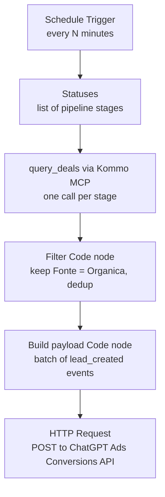

# Hackaton-altegio — ChatGPT Ads → Kommo conversion pipeline

Feeds sales-lead conversions from **Kommo CRM** into the **OpenAI / ChatGPT Ads**
Conversions API, so ad-driven leads show up as conversions in Ads Manager and you
can see a funnel from **ad → lead → sale**.

Built as a no-code **n8n** workflow that polls Kommo (through Altegio's internal
MCP) and posts `lead_created` events to ChatGPT Ads.

## How it works



1. **Schedule Trigger** – runs the workflow on an interval.
2. **Statuses** – emits one item per Inside Sales stage (`query_deals` only filters
   by status, not by pipeline alone).
3. **query_deals** (Kommo MCP) – runs once per stage and returns that stage's leads.
4. **Filter** – merges all stages, keeps only ChatGPT-sourced leads
   (`Fonte = "Orgânica"`), dedups by lead id.
5. **Build payload** – turns the leads into a batch of `lead_created` events.
6. **HTTP Request** – posts the batch to the ChatGPT Ads Conversions API.

## The n8n nodes

Code for each node is in [`n8n/`](n8n/); node settings are in
[`n8n/SETUP.md`](n8n/SETUP.md).

| Node | File |
|---|---|
| Statuses | [`n8n/01-statuses.js`](n8n/01-statuses.js) |
| Filter | [`n8n/02-filter.js`](n8n/02-filter.js) |
| Build payload | [`n8n/03-build-payload.js`](n8n/03-build-payload.js) |

> The n8n workflow JSON itself isn't included here — export it from n8n
> (workflow → ⋯ → Download) and drop it in `n8n/workflow.json` if you want it
> version-controlled.

## ChatGPT Ads Conversions API

- **Endpoint:** `POST https://bzr.openai.com/v1/events?pid=<PIXEL_ID>`
- **Auth:** `Authorization: Bearer <CONVERSION_KEY>` — the Conversions API key from
  Ads Manager → Conversions tab (**not** an OpenAI platform `sk-...` key)
- **Event type used:** `lead_created`
- **Timestamp:** `timestamp_ms` is Unix **milliseconds** and **must be within the
  last 7 days** — older events are rejected, so historical backfill isn't possible.
- **Batch:** up to 1000 events per request.
- Docs: <https://developers.openai.com/ads/conversions-api>

Minimal event we send (no PII, so attribution relies on ChatGPT's advanced
matching where available):

```json
{
  "id": "<kommo_lead_id>",
  "type": "lead_created",
  "timestamp_ms": 1700000000000,
  "action_source": "offline",
  "data": { "type": "customer_action" }
}
```

## Kommo access (via Altegio MCP)

- **Endpoint:** `https://mcp.alteg.io/kommo/br/mcp` (transport: HTTP Streamable)
- **Auth:** `Authorization: Bearer <MCP_MACHINE_TOKEN>` (machine token, scope
  `mcp:kommo:read`)
- **Tools used:** `query_deals` (search leads by pipeline/status), `list_pipelines`
- Pipeline: **Inside Sales**; ChatGPT-sourced leads are tagged `Fonte = "Orgânica"`.

## Known limitations / TODO

The pieces that make the numbers exact — most are asks for the MCP owner:

- [ ] **`query_deals` caps its result set** and can't filter by a custom field.
  Kommo's API supports both — ask the MCP owner to add a **`Fonte` / custom-field
  filter** and **pagination** so it returns the full set (Kommo UI shows ~5,402
  Orgânica leads in Inside Sales; the MCP currently surfaces far fewer).
- [ ] **Native `created_at` is not returned** by the MCP (only inconsistent custom
  fields), so conversion dates fall back to "now." Ask the MCP owner to include the
  native lead `created_at`.
- [ ] **Contact email/phone are not exposed** by the MCP, so events go out without
  user-matching data. Ask for a tool that returns the linked contact's email/phone
  (hashed) for better ad attribution.
- [ ] Add a **Remove Duplicates** node (dedup across runs on `lead_id`) before
  enabling the schedule, so leads aren't re-counted every run.
- [ ] Flip `validate_only` to `false` in the build-payload node to record events
  for real (it defaults to `true` = validate only).
- [ ] Interim: the filter can run **unfiltered** until the MCP `Fonte` filter lands
  — set `FILTER_BY_FONTE = true` in `02-filter.js` for accurate counts.

## Credentials (never commit these)

Provide these as **n8n credentials**, not in code:

- `MCP_MACHINE_TOKEN` — Kommo MCP machine token
- `CONVERSION_KEY` — ChatGPT Ads Conversions API key
- `PIXEL_ID` — your "Kommo lead" pixel ID from Ads Manager
